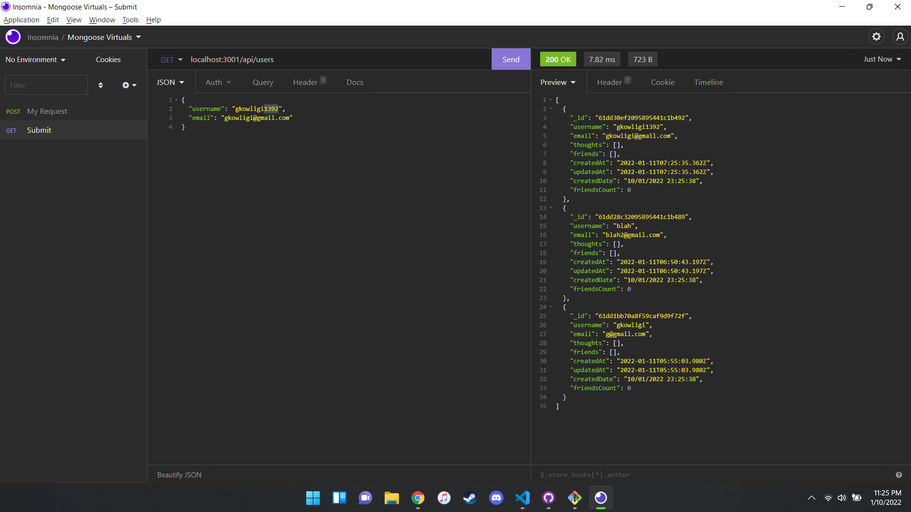

# social-network-api

## Description

Create a basic social media API with crud operations, for users, thoughts, reactions, and friends.

## Table of Contents

- [Usage](#usage)
- [Technology](#Technology)
- [Questions](#questions)
- [License](#license)

## Usage

Clone the project files and run npm install, and view routes using postman or insomnia.

## Technologies Used

- Node
- Express
- MomentJS
- MongoDB

## Questions

For any questions, feel free to contact me at gkowligi@gmail.com

Checkout my [GitHub profile](https://github.com/gkowligi1392)

## License

Code released under the MIT License [License](https://choosealicense.com/licenses/mit/).
For additional questions, please feel free to contact us via email at gkowligi@gmail.com